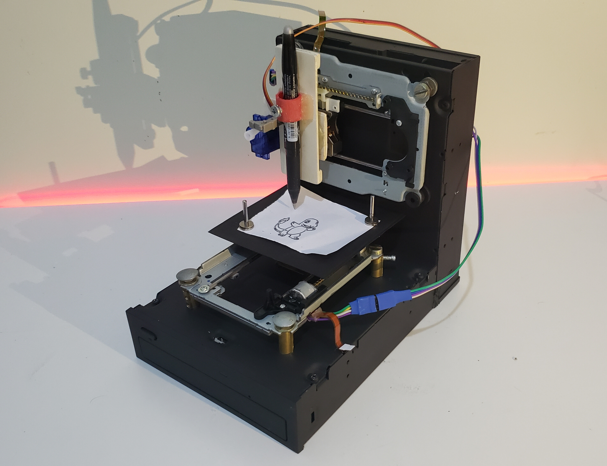
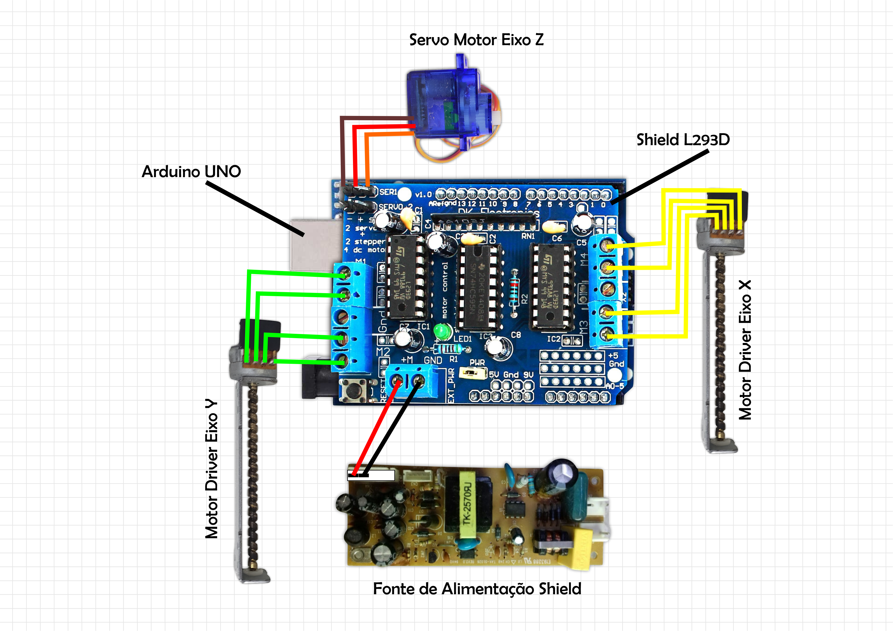

# DESENVOLVIMENTO DE UMA MÁQUINA CNC UTILIZANDO ARDUINO E LIXO ELETRÔNICO

Este projeto foi desenvolvido para conclusão de curso Técnico em Informática pelo Instituto Federal do Amazonas - IFAM/Campus Lábrea. Tem como objetivo desenvolver uma máquina CNC (Comandos Numéricos Computadorizado) de baixo custo, software e hardware abertos, utilizando a plataforma Arduino e componentes eletrônicos reciclados. A máquina será feita através de drives CD-ROM e um servo motor, que serão controlados pelo arduino e irão trabalhar nos eixos x, y e z, com a finalidade de produzir desenhos.

## Tecnologias Utilizadas

#### Ferramentas:
* [IDE Arduino](https://www.arduino.cc/en/software)
* [Tinkercard](https://www.tinkercad.com/)
* [Inkscape](https://inkscape.org/pt-br/release/inkscape-1.4/) 
* [GcodeSender](https://chromewebstore.google.com/detail/gcode-sender/ngncibnakmabjlfpadjagnbdjbhoelom).

#### Linguagens
* [C++](https://devdocs.io/cpp/)
* [Gcode](https://marlinfw.org/meta/gcode/)

#### Bibliotecas
* [Servo.h](https://docs.arduino.cc/libraries/servo/)
* [AFMotor.h](https://github.com/adafruit/Adafruit-Motor-Shield-library/)

## Materiais Utilizados

* Arduino Uno
* Shield L293D
* Servo Motor
* Driver de CD-ROM
* Fonte de alimentação 12v

## Circuito

Na imagem abaixo, está representado o circuito eletrônico utilizado no projeto. Nela, é possível observar as conexões dos motores, do servo e da fonte de alimentação com o Shield L293D, que está acoplado ao Arduino Uno.

Para simulação, geralmente utilizamos plataformas como o [Tinkercad](https://www.tinkercad.com/) (plataforma online) e o [Fritzing](https://fritzing.org/download/) (plataforma instalável). No nosso caso, montamos e testamos o circuito diretamente no ambiente físico, o que, de imediato, não recomendamos, pois há risco de danificar componentes. O ideal é sempre realizar testes em um ambiente simulado primeiro, minimizando possíveis prejuízos com as placas e garantindo um funcionamento seguro do projeto.

## Contato

Para quem deseja utilizar o projeto ou investir em nossas novas ideias e iniciativas, entre em contato pelo e-mail abaixo. Também disponibilizarei a chave Pix para doações, contribuindo assim para o crescimento e desenvolvimento de novos projetos.

 * **Email:** douglasoliveira.trabalho@gmail.com
 * **Chave pix (CPF):** 04784486275